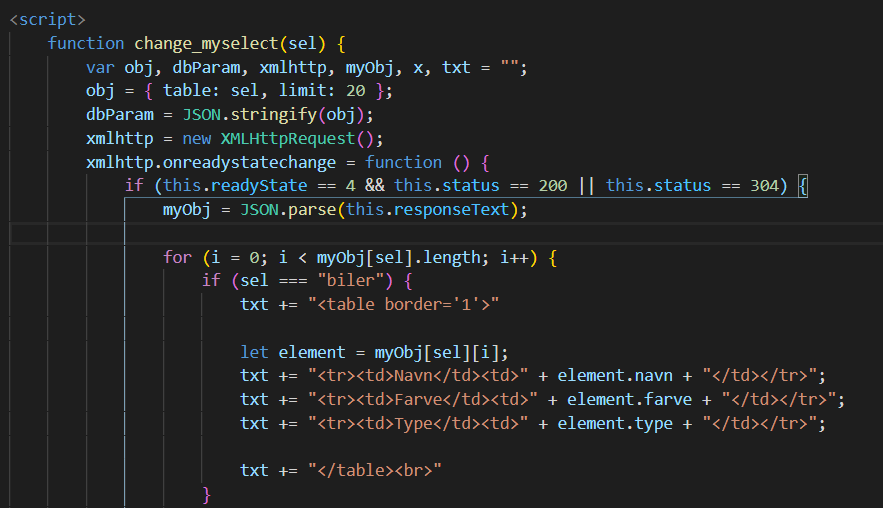
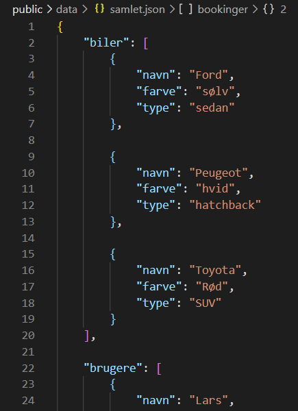

# JSONexercise

### Opdatering 28/09/20

Der er nu tre sider: index, lease og liste.  
Startsiden har nu to knapper til to routes: En der viser GET metode og en der viser POST.  
Listen er på liste route'en og er uændret fra før. Denne tilgås fra højre knap.  
Den venstre knap er til en ny lease route hvor data kan indtastes og derefter gemmes i den samlet JSON fil.  
Man kan derefter se den nye data på listen.

---

Et Express project hvor json data bliver fodret til html. Det kører på localhost:3000 når programmet er startet.  
Løsningen er baseret på Dynamic HTML Table tutorial fra W3schools.  
Link: https://www.w3schools.com/js/js_json_html.asp

Eksempler på Kode:

Fra ./views/index.hbs

Fra ./public/data/samlet.json

